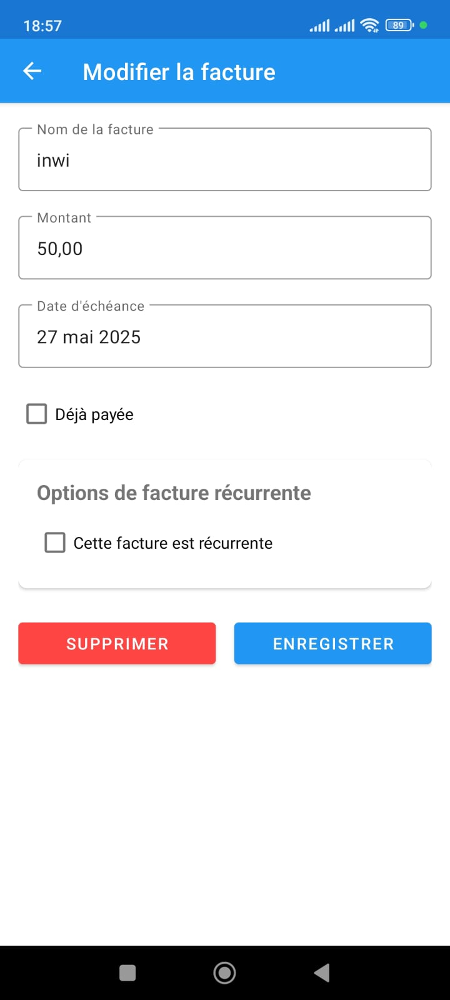

# Rappel de Paiement de Factures (Bill Payment Reminder)

Application Android native en Java qui sert de rappel pour le paiement de factures.

## Fonctionnalités

- Ajout de factures avec nom, montant et date d'échéance
- Stockage local des données avec SQLite
- Affichage des factures à venir dans une liste
- Notification de rappel de paiement la veille de l'échéance
- Interface responsive et intuitive
- Suivi de l'état des factures (payées, en retard, à venir)

## Structure du Projet

Le projet est organisé selon l'architecture MVC :

### Modèle

- `Bill.java` : Classe modèle représentant une facture
- `BillDatabaseHelper.java` : Gestion de la base de données SQLite

### Vue

- `activity_main.xml` : Interface principale affichant la liste des factures
- `activity_add_edit_bill.xml` : Interface d'ajout et modification de factures
- `bill_item.xml` : Mise en page d'un élément de facture dans la liste

### Contrôleur

- `MainActivity.java` : Activité principale gérant l'affichage des factures
- `AddEditBillActivity.java` : Activité pour ajouter/modifier une facture
- `BillAdapter.java` : Adaptateur pour l'affichage des factures dans la liste
- `NotificationHelper.java` : Gestion des notifications
- `NotificationReceiver.java` : Récepteur pour les notifications programmées

## Fonctionnement des Notifications

L'application utilise AlarmManager pour programmer des notifications la veille de la date d'échéance. Si l'appareil est redémarré, les notifications sont reprogrammées automatiquement.

## Exigences Techniques

- Android 5.0 (API 21) ou supérieur
- Compilé avec SDK 30
- Développé en Java

## Installation

Importez le projet dans Android Studio et lancez l'application sur un émulateur ou un appareil physique.
#
